# AWS ECS Fargate Deployment with Terragrunt & GitHub Actions CI/CD

A production-grade containerised application deployment on AWS ECS Fargate, demonstrating Infrastructure as Code (IaC) best practices, GitOps workflows, and secure CI/CD automation.

## 📋 Project Overview

This project showcases the deployment of a React-based threat modelling application to AWS using modern DevOps practices. The infrastructure is fully automated, secure, and follows the principle of least privilege throughout.

### What I Built

- **Fully automated CI/CD pipeline** using GitHub Actions with OIDC authentication (zero static credentials)
- **Modular Infrastructure as Code** using Terraform modules orchestrated by Terragrunt
- **Tiered infrastructure design** separating bootstrap, platform, and workload layers
- **Production security patterns** including private subnets, TLS termination, and scoped IAM policies

### Technology Stack

| Category | Technology |
|----------|------------|
| Cloud Provider | AWS (ECS Fargate, ALB, VPC, Route53, ACM, ECR) |
| Infrastructure as Code | Terraform 1.14.3, Terragrunt 0.95.1 |
| CI/CD | GitHub Actions with OIDC Federation |
| Application | React, Nginx, Docker |
| DNS | Cloudflare (delegation) → Route53 |
| Region | eu-west-2 (London) |

---

## 🏗️ Architecture

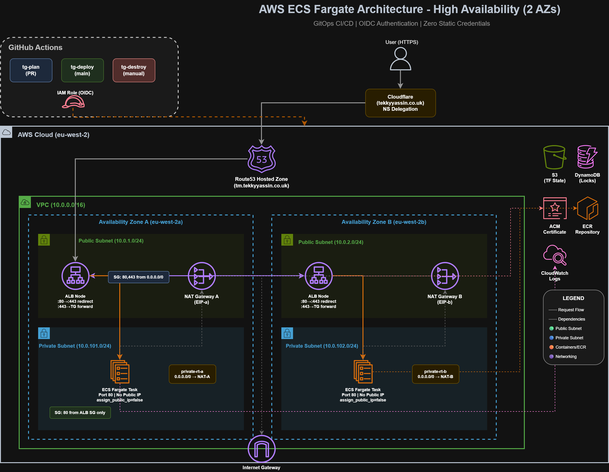

### Infrastructure Tiers

| Tier | Purpose | Components | Lifecycle |
|------|---------|------------|-----------|
| **Tier 0** | Bootstrap | OIDC Provider, IAM Role, S3 State Backend, DynamoDB Locks | One-time setup, rarely changed |
| **Tier 1** | Platform | VPC, Route53 Hosted Zone, ACM Certificate, ECR Repository | Long-lived, stable |
| **Tier 2** | Workloads | ALB, ECS Service, Route53 A Record | Frequently deployed/destroyed |

### Request Flow
```
User Request (HTTPS)
        │
        ▼
┌──────────────────┐
│    Cloudflare    │  ← NS delegation to Route53
│   (Apex DNS)     │
└────────┬─────────┘
         │
         ▼
┌──────────────────┐
│     Route53      │  ← Hosted zone for subdomain
│ (tm.tekkyyassin) │
└────────┬─────────┘
         │
         ▼
┌──────────────────┐
│       ALB        │  ← TLS termination (ACM certificate)
│   (Public SG)    │  ← HTTP → HTTPS redirect
└────────┬─────────┘
         │
         ▼
┌──────────────────┐
│   ECS Fargate    │  ← Private subnets
│     (Tasks)      │  ← Pulls image from ECR
└──────────────────┘
```

---

## 🏃 Running the Application Locally

### Prerequisites

- Node.js 20+
- Yarn package manager
- Docker (for containerised run)

### Option 1: Without Docker (Development Mode)
```bash
cd app
yarn install
yarn start
# Application runs at http://localhost:3000
```

### Option 2: With Docker (Production-like)
```bash
cd app
docker build -t threatmod:local .
docker run -d --rm -p 8080:80 threatmod:local
# Application runs at http://localhost:8080
```

### Verified Local Deployment

The application running locally in a Docker container:

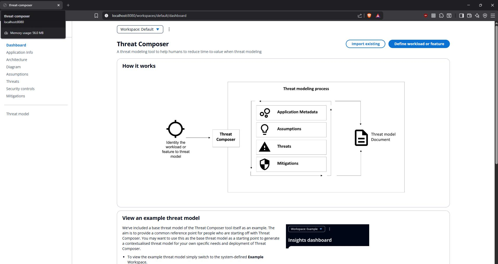

Health check endpoint verification:

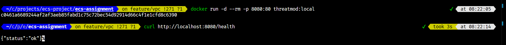

---

## 📦 Container Registry (ECR)

Docker images are stored in Amazon Elastic Container Registry, providing secure, scalable image storage with IAM-based authentication.

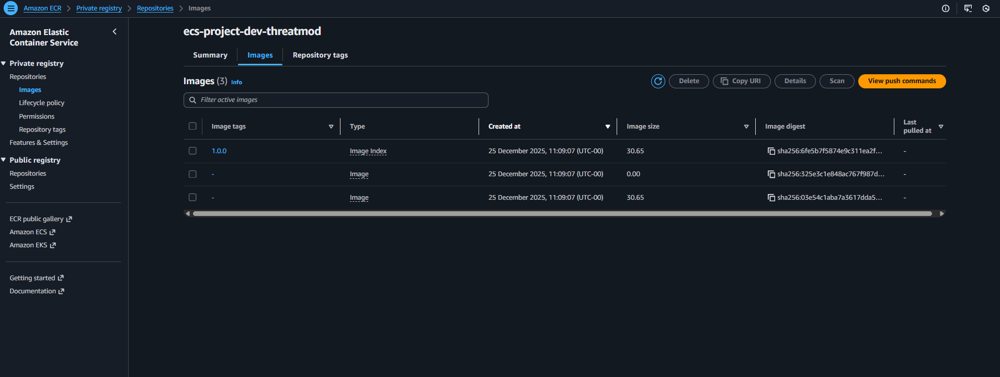

---

## 🔒 TLS Certificate (ACM)

SSL/TLS certificate managed by AWS Certificate Manager with DNS validation via Cloudflare. The certificate covers `tm.tekkyyassin.co.uk` and is automatically renewed by AWS.

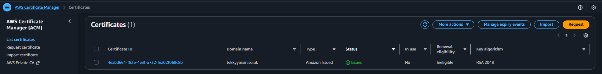

---

## 🌐 Production Deployment

The application is deployed to ECS Fargate behind an Application Load Balancer with TLS termination.

### Live Endpoint
```
https://tm.tekkyyassin.co.uk
https://tm.tekkyyassin.co.uk/health
```

### Verified Production Deployment

Application accessible via HTTPS on custom domain:

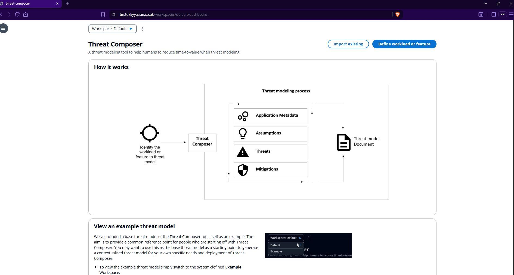

Full application functionality verified in production:

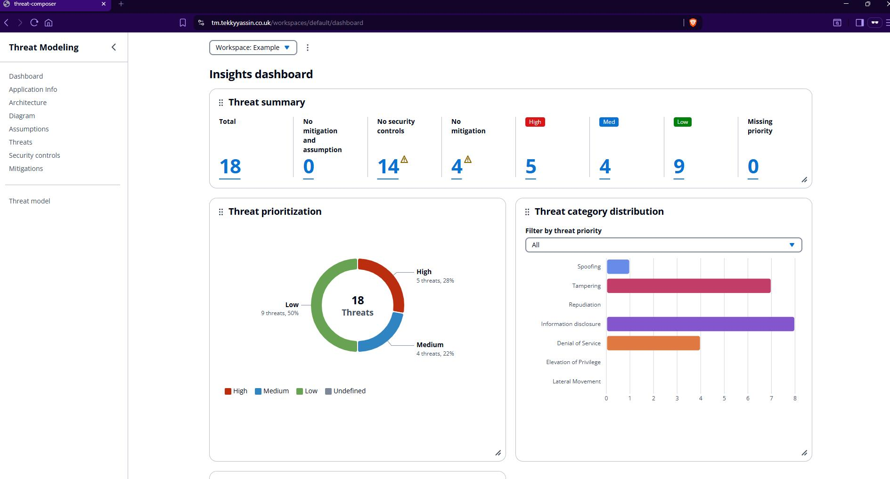

---

## 🔐 OIDC Federation

GitHub Actions authenticates to AWS using OpenID Connect — no static credentials stored anywhere.

### How It Works

1. GitHub generates a signed JWT token for the workflow run
2. Token includes claims: repository, branch, workflow, actor
3. AWS STS validates the token against the OIDC provider
4. Temporary credentials are issued with scoped IAM permissions
5. Credentials expire after the workflow completes

### Verified OIDC Authentication

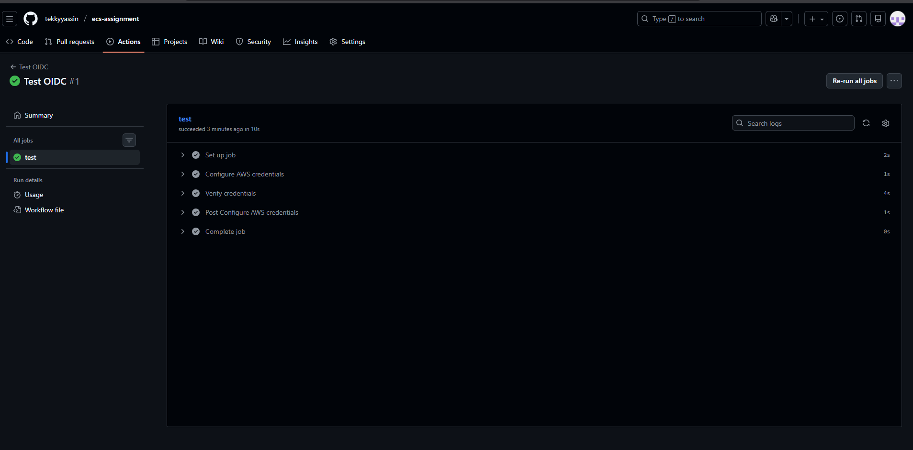

---

## 🔄 CI/CD Workflows

### Pipeline Overview

| Workflow | Trigger | Purpose |
|----------|---------|---------|
| `tg-plan.yml` | Pull Request | Preview infrastructure changes |
| `tg-deploy.yml` | Push to main | Build, push, and deploy |
| `tg-destroy.yml` | Manual | Tear down with safety confirmation |

### Plan Workflow (Pull Request)

Runs `terragrunt plan` on PRs to preview changes before merging:

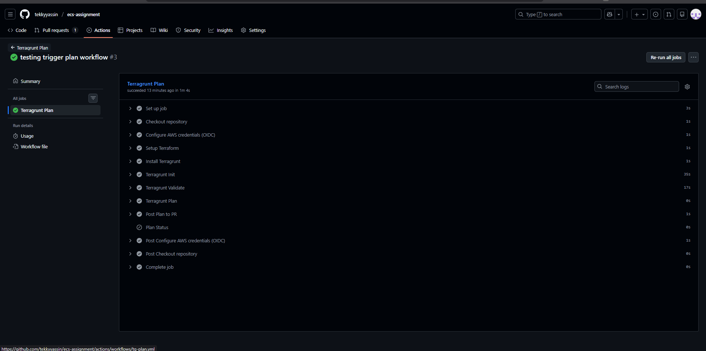

### Deploy Workflow (Push to Main)

Full CI/CD pipeline: build Docker image, push to ECR, deploy infrastructure, smoke test:

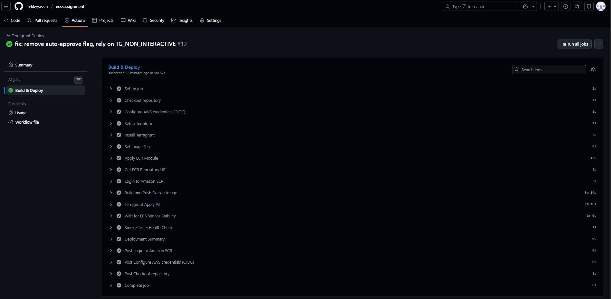

### Destroy Workflow (Manual with Safety)

The destroy workflow requires typing `DESTROY` exactly (case-sensitive) to prevent accidental infrastructure deletion.

**Safety check working correctly** — lowercase `destroy` rejected:

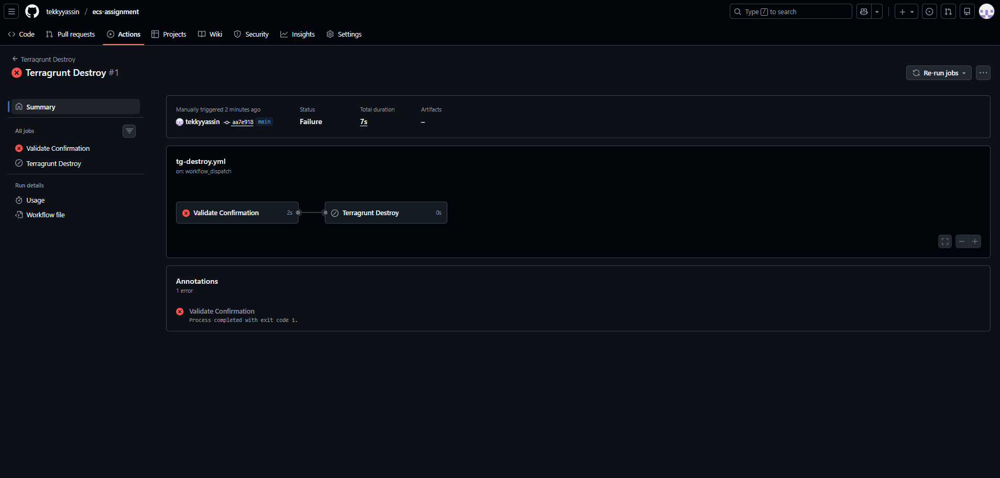

**Successful destruction** after correct confirmation:

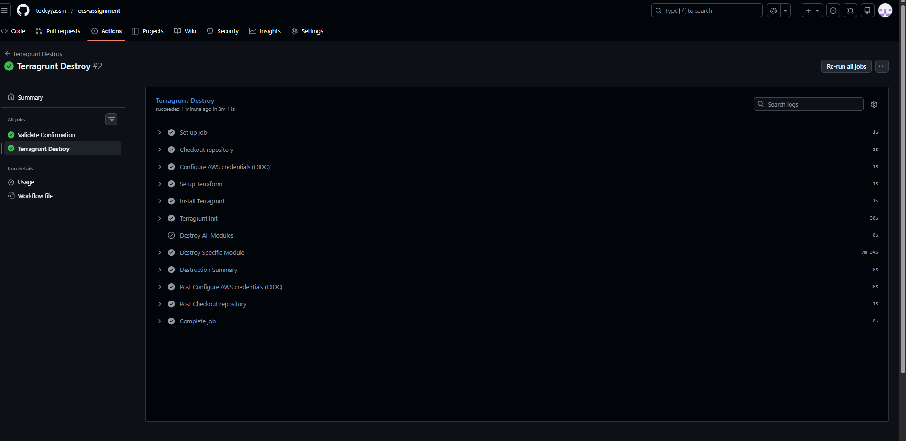

---

## 🔐 Security Implementation

| Security Concern | Solution Implemented |
|------------------|---------------------|
| No hardcoded credentials | GitHub OIDC federation with AWS IAM |
| Least privilege access | Scoped IAM policies, iteratively refined from AccessDenied errors |
| Network isolation | ECS tasks in private subnets, only ALB exposed publicly |
| Encryption in transit | TLS termination at ALB using ACM-managed certificate |
| State file security | S3 bucket with encryption + DynamoDB locking |
| Destructive action protection | Manual workflow with explicit `DESTROY` confirmation |
| Code quality gates | Pre-commit hooks with ESLint, Prettier, Checkov, TFLint, Trivy |

---

## 📁 Project Structure
```
.
├── app/                                    # React application
│   ├── src/                                # Source code
│   ├── Dockerfile                          # Multi-stage build (Node → Nginx)
│   ├── nginx.conf                          # Nginx configuration
│   ├── .prettierrc                         # Prettier configuration
│   ├── .eslintrc.json                      # ESLint configuration
│   └── package.json
│
├── infra/
│   ├── bootstrap/
│   │   └── oidc/                           # GitHub OIDC provider & IAM role (Tier 0)
│   │
│   ├── modules/                            # Reusable Terraform modules
│   │   ├── vpc/                            # VPC, subnets, NAT gateway, IGW
│   │   ├── ecr/                            # Elastic Container Registry
│   │   ├── acm/                            # TLS certificate with DNS validation
│   │   ├── alb/                            # Application Load Balancer + listeners
│   │   ├── ecs/                            # ECS cluster, service, task definition
│   │   ├── route53-zone/                   # Hosted zone for subdomain
│   │   └── route53-record/                 # A record pointing to ALB
│   │
│   └── live/
│       ├── root.hcl                        # Remote state configuration (S3 + DynamoDB)
│       └── env/
│           └── dev/                        # Development environment
│               ├── env.hcl                 # Environment-specific variables
│               ├── vpc/terragrunt.hcl
│               ├── ecr/terragrunt.hcl
│               ├── acm/terragrunt.hcl
│               ├── alb/terragrunt.hcl
│               ├── ecs/terragrunt.hcl
│               ├── route53-zone/terragrunt.hcl
│               └── route53-record/terragrunt.hcl
│
├── .github/
│   └── workflows/
│       ├── tg-plan.yml                     # PR: runs terragrunt plan
│       ├── tg-deploy.yml                   # Main: builds, pushes, deploys
│       └── tg-destroy.yml                  # Manual: destroys with confirmation
│
├── .pre-commit-config.yaml                 # Pre-commit hook configuration
│
└── docs/
    ├── architecture-diagram.png
    └── screenshots/
```

---

## 🧗 Challenges Encountered & Solutions

### 1. Terragrunt v0.95.x CLI Syntax Changes

**Problem:** The `terragrunt run-all` command syntax changed in v0.95.x, causing pipeline failures.

**Solution:** Updated all commands to use `terragrunt run --all <command>` format.

### 2. Pre-commit Hook Conflicts (ESLint vs Prettier)

**Problem:** ESLint's `@typescript-eslint/indent` and `quote-props` rules conflicted with Prettier's formatting, causing an infinite loop of fixes.

**Solution:** Disabled the conflicting rules in ESLint (`["off"]`) and let Prettier handle all formatting. Created `.prettierrc` with matching rules for quotes and trailing commas.

### 3. IMAGE_TAG Environment Variable Not Passed to ECS

**Problem:** ECS service attempted to pull non-existent image tags, resulting in `CannotPullContainerError`.

**Solution:** Explicitly passed `IMAGE_TAG` and `ECR_REPO_URL` as environment variables in the workflow's Terragrunt apply step.

### 4. IAM Permission Iteration

**Problem:** GitHub Actions role missing `iam:TagRole` permission, causing role creation to fail.

**Solution:** Iteratively added permissions based on AccessDenied errors. This is the recommended least-privilege approach—start minimal and add only what's required.

### 5. ECR Authentication Expiry

**Problem:** Docker push failed with 403 Forbidden after credentials expired.

**Solution:** Run `docker logout` followed by fresh `aws ecr get-login-password` to clear cached credentials.

---

## 💰 Cost Considerations

### Monthly Estimate (Dev Environment Running 24/7)

| Resource | Approximate Cost |
|----------|------------------|
| NAT Gateway | ~£25 |
| Application Load Balancer | ~£13 |
| ECS Fargate (256 CPU, 512MB) | ~£7 |
| Route53 Hosted Zone | £0.40 |
| ECR Storage | < £1 |
| **Total** | **~£46/month** |

### Cost Optimisation Strategy

- **Destroy Tier 2** (ALB, ECS, Route53 record) when not actively developing
- **Keep Tier 0/1** (OIDC, Route53 zone, ACM, ECR) — free or negligible cost
- **Redeploy time:** ~3 minutes via CI/CD pipeline

---

## 🎯 Key Learnings

1. **OIDC Federation > Static Keys**
   - More secure, automatically rotating, no secrets to manage or rotate
   - GitHub's identity is verified directly by AWS

2. **Tiered Infrastructure Design**
   - Separating bootstrap/platform/workloads enables different lifecycles
   - Can destroy workloads without affecting foundational resources

3. **GitOps Workflow Benefits**
   - Plan on PR enables review before changes
   - Apply on merge ensures main branch reflects deployed state
   - Manual destroy with confirmation prevents accidents

4. **Least Privilege Iteration**
   - Start with minimal permissions
   - Add permissions based on specific AccessDenied errors
   - Results in tightly scoped policies

5. **Mock Outputs for Planning**
   - Terragrunt's `mock_outputs` enables `plan` when dependencies don't exist
   - Essential for CI/CD pipelines running plan on PRs

6. **Separation of Concerns (Prettier vs ESLint)**
   - Prettier owns formatting (indentation, quotes, line length)
   - ESLint owns code quality (unused variables, imports, logic)
   - Overlapping rules cause conflicts

---

## 📚 References

- [Terragrunt Documentation](https://terragrunt.gruntwork.io/)
- [AWS ECS Best Practices Guide](https://docs.aws.amazon.com/AmazonECS/latest/bestpracticesguide/)
- [GitHub OIDC with AWS](https://docs.github.com/en/actions/deployment/security-hardening-your-deployments/configuring-openid-connect-in-amazon-web-services)
- [Terraform AWS Provider](https://registry.terraform.io/providers/hashicorp/aws/latest/docs)

---

## 👤 Author

**tekkyyassin**

This project was completed as part of my DevOps engineering portfolio, demonstrating production-grade infrastructure automation and CI/CD practices.
